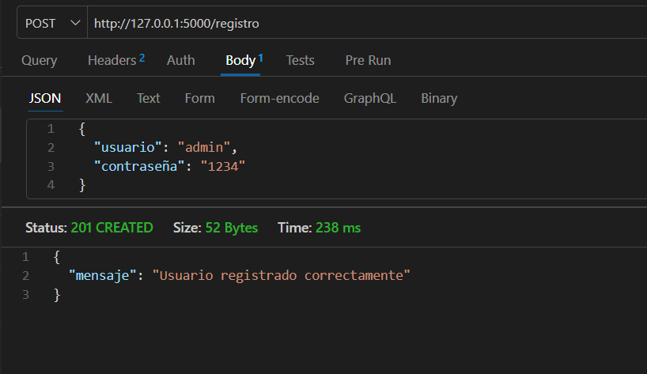
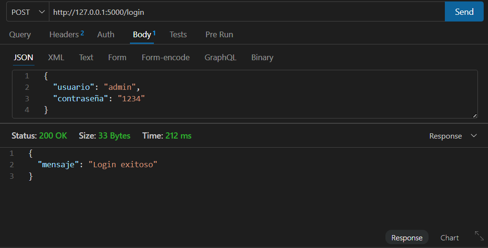
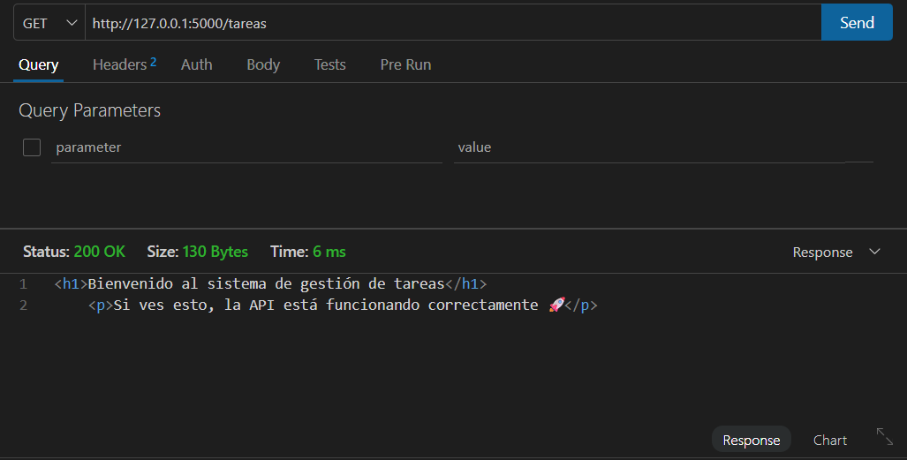
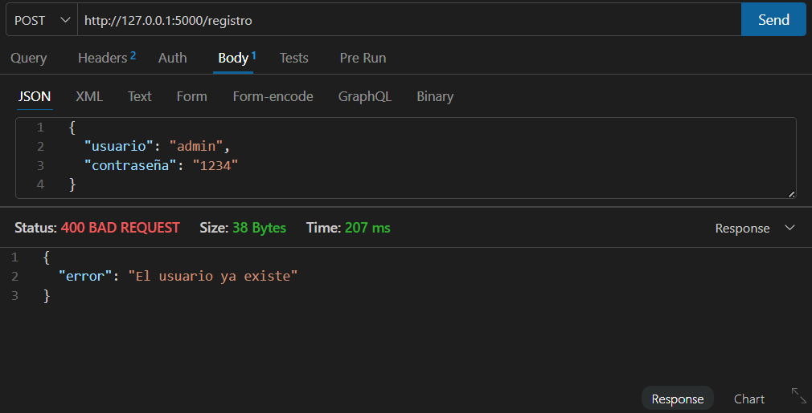
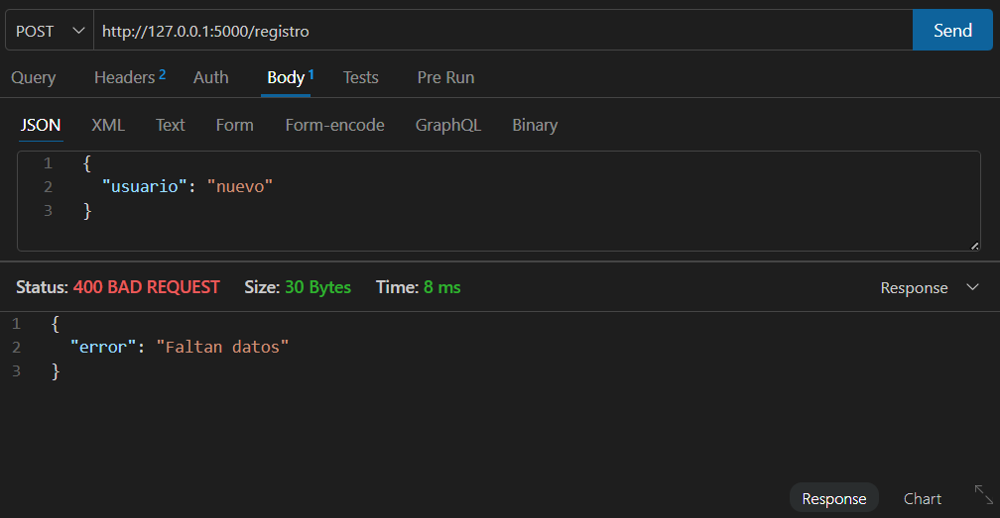
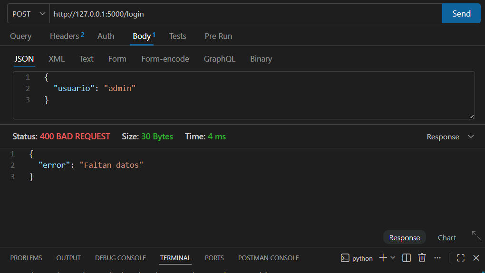
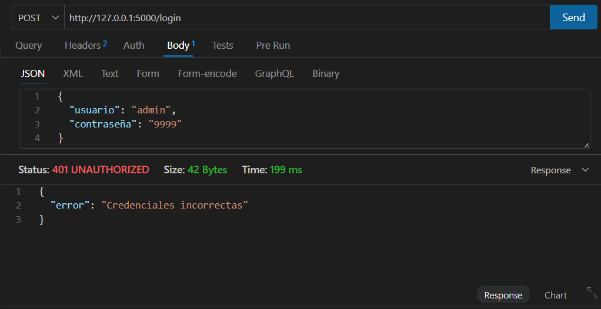
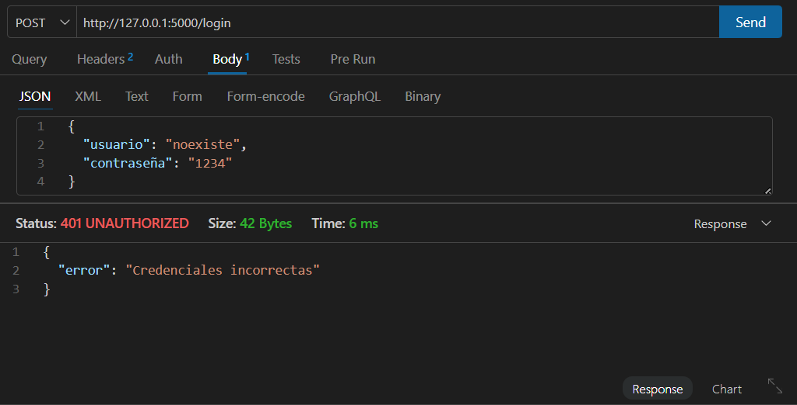

# PFO 2 - Sistema de Gestión de Tareas con API y Base de Datos

## Descripción

Este proyecto consiste en el desarrollo de una API REST utilizando Flask que permite:

* Registrar usuarios
* Iniciar sesión
* Acceder a un endpoint protegido de tareas

La aplicación implementa almacenamiento persistente con SQLite y seguridad mediante el hash de contraseñas.

---

## Tecnologías utilizadas

* Python 
* Flask
* SQLite
* Flask-Bcrypt

---

## Instalación

1. Clonar el repositorio:

```bash
git clone 
cd 
```

2. Instalar dependencias:

```bash
pip install flask flask-bcrypt
```

---

##  Ejecución del proyecto

```bash
python servidor.py
```

El servidor se ejecutará en:

```
http://127.0.0.1:5000/
```

---

##  Endpoints disponibles

### 🔹 Registro de usuario

* **URL:** `/registro`
* **Método:** POST
* **Body:**

```json
{
  "usuario": "admin",
  "contraseña": "1234"
}
```

* **Respuesta exitosa (201):**

```json
{
  "mensaje": "Usuario registrado correctamente"
}
```

---

### 🔹 Inicio de sesión

* **URL:** `/login`
* **Método:** POST
* **Body:**

```json
{
  "usuario": "admin",
  "contraseña": "1234"
}
```

* **Respuesta exitosa (200):**

```json
{
  "mensaje": "Login exitoso"
}
```

---

### 🔹 Endpoint de tareas

* **URL:** `/tareas`
* **Método:** GET
* **Descripción:** Devuelve una página HTML de bienvenida.

---

## Pruebas realizadas

Se validaron los siguientes casos:

### Casos exitosos

* Registro de usuario


* Inicio de sesión correcto


* Acceso al endpoint `/tareas`


### Casos de error

* Registro con usuario duplicado


* Registro con datos incompletos


* Inicio de sesión con datos incompletos


* Login con contraseña incorrecta


* Login con usuario inexistente


---

## Seguridad: ¿Por qué hashear contraseñas?

Las contraseñas no se almacenan en texto plano, sino en formato hash utilizando Flask-Bcrypt.

Esto permite:

* Proteger los datos en caso de filtraciones
* Evitar que terceros puedan ver contraseñas reales
* Aumentar la seguridad del sistema

---

## Base de datos: ¿Por qué SQLite?

Se eligió SQLite porque:

* No requiere instalación de servidor
* Es liviano y fácil de usar
* Ideal para proyectos pequeños o educativos
* Permite persistencia de datos en un archivo local

---

## Estructura del proyecto

```
pfo2-api-tareas/
│
├── servidor.py
├── database.db
├── README.md
```

---


## Autor

* Estudiante: Estefania Vago
* Materia: Programación sobre redes
* Año: 2026


